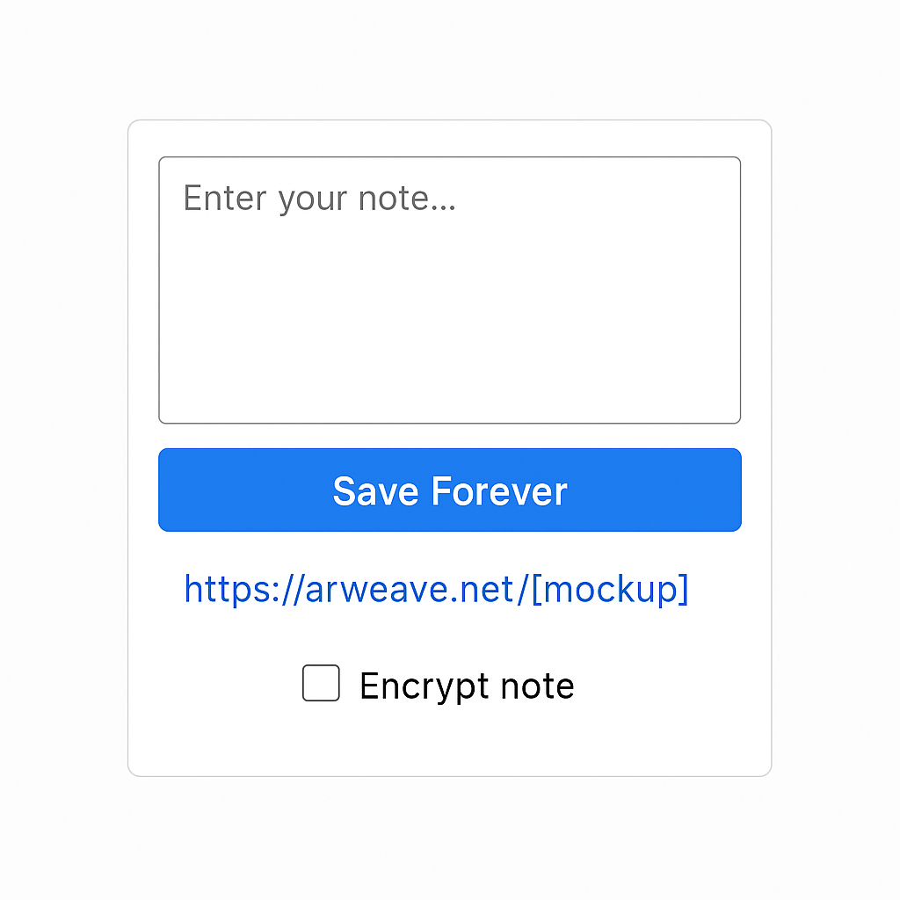

PermaNote – Permanent Notes on Arweave

PermaNote is a minimal web-based app that lets users write text and save it forever on the Arweave blockchain. No accounts. No servers. Just your thoughts, permanently stored.

---

UI Mockup

*A clean, single-screen layout with a text box, "Save Forever" button, and link preview.*

---

Features
- Simple note editor
- Click "Save Forever" to upload to Arweave
- Get a permanent, uncensorable link
- Optional: view your past notes

---

Tech Stack (Planned)
- HTML, CSS, JavaScript (Vanilla or React)
- Arweave.js or Bundlr SDK for uploads
- Optional: ArConnect for wallet connection

---

Status
- ✅ Project Planning
- 🟨 MVP Design
- ⬜️ Development
- ⬜️ Testing
- ⬜️ Deploy
- ⬜️ Submit to Microgrant

---

💰 Grant Plan
We aim to request **$6,000 USD** from the Arweave microgrant fund to:
- Build MVP
- Cover dev time and design
- Pay for Arweave upload fees
- Release open-source version for anyone to use

---

Contact
Built by Bledar Tola

DMs open for collabs, feedback, or forks.

